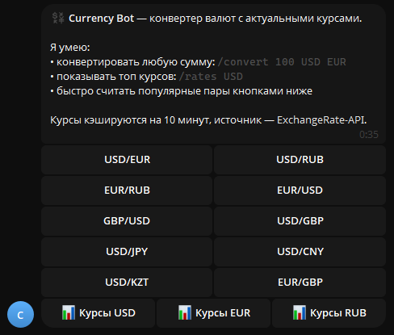

# 💱 Telegram Currency Bot

[](https://www.python.org/downloads/)
[](https://docs.aiogram.dev/en/latest/)
[](LICENSE)

Асинхронный Telegram-бот на **Python 3.11+** и **aiogram 3**: конвертация валют по актуальным курсам, топ котировок и кнопки популярных пар. Курсы кэшируются в памяти на 10 минут, чтобы не дёргать внешнее API.

---

## 📑 Оглавление

- [Описание](#-описание)
- [Демо](#-демо)
- [Возможности](#-возможности)
- [Стек технологий](#-стек-технологий)
- [Установка и запуск](#-установка-и-запуск)
- [Использование](#-использование)
- [Структура проекта](#-структура-проекта)
- [Docker](#-docker)
- [Деплой](#-деплой)
- [Тестирование](#-тестирование)
- [Лицензия](#-лицензия)
- [Контакты / Автор](#-контакты--автор)

---

## 📌 Описание

Бот принимает сумму и коды ISO 4217 (`USD`, `EUR`, `RUB`, …), ходит в публичный API курсов и отвечает готовой суммой. Для быстрых сценариев есть inline-кнопки пар вроде USD/EUR и USD/RUB.

Источник котировок по умолчанию — бесплатный endpoint без ключа:

- [ExchangeRate-API v4 latest](https://www.exchangerate-api.com/docs/free)
- URL: `https://api.exchangerate-api.com/v4/latest/{BASE}`

Документация фреймворка бота: [aiogram 3](https://docs.aiogram.dev/en/latest/).

---

## 🖼 Демо



Пример диалога:

```text
Вы:  /start

Бот: 💱 Currency Bot — конвертер валют с актуальными курсами.
     Я умею:
     • конвертировать любую сумму: /convert 100 USD EUR
     • показывать топ курсов: /rates USD
     • быстро считать популярные пары кнопками ниже
     [USD/EUR] [USD/RUB] [EUR/RUB] …
```

---

## ✨ Возможности

- Команда `/start` — приветствие и описание возможностей
- Команда `/convert 100 USD EUR` — конвертация произвольной суммы
- Команда `/rates USD` — топ-10 популярных курсов к указанной валюте
- Команда `/help` — справка по формату команд
- Inline-кнопки популярных пар: USD/EUR, USD/RUB, EUR/RUB, GBP/USD и другие
- Быстрый выбор сумм 1 / 10 / 100 / 1000 после выбора пары
- Кэш курсов в памяти на 10 минут (`CACHE_TTL`)
- Фоновый прогрев USD/EUR/RUB через APScheduler
- Понятные ошибки: неверный формат, неизвестная валюта, недоступность API
- Логирование через стандартный модуль `logging`
- Готовые `Dockerfile` и `docker-compose.yml`

---

## 🛠 Стек технологий

| Компонент | Назначение |
| --- | --- |
| Python 3.11+ | Язык приложения |
| [aiogram 3.x](https://docs.aiogram.dev/en/latest/) | Асинхронный Telegram Bot API |
| [aiohttp](https://docs.aiohttp.org/) | HTTP-клиент для API курсов |
| [python-dotenv](https://saurabh-kumar.com/python-dotenv/) | Загрузка `.env` |
| [APScheduler](https://apscheduler.readthedocs.io/) | Прогрев и очистка кэша |
| ExchangeRate-API | Бесплатные курсы без ключа |
| pytest + pytest-asyncio | Юнит-тесты |

---

## 🚀 Установка и запуск

### 1. Клонирование репозитория

```bash
git clone https://github.com/<your-username>/telegram-currency-bot.git
cd telegram-currency-bot
```

### 2. Виртуальное окружение

**Windows (PowerShell):**

```powershell
python -m venv .venv
.\.venv\Scripts\Activate.ps1
```

**Linux / macOS:**

```bash
python3 -m venv .venv
source .venv/bin/activate
```

### 3. Установка зависимостей

```bash
pip install -r requirements.txt
```

### 4. Токен у [@BotFather](https://t.me/BotFather)

В Telegram:

```text
/newbot
```

Скопируйте токен вида `123456789:AAE...`.

По желанию задайте команды бота вручную:

```text
/setcommands
start - Приветствие и популярные пары
convert - Конвертация: /convert 100 USD EUR
rates - Топ курсов: /rates USD
help - Справка
```

При старте бот сам вызывает `set_my_commands`.

### 5. Настройка `.env`

```bash
cp .env.example .env
```

Windows (PowerShell):

```powershell
Copy-Item .env.example .env
```

Отредактируйте файл:

```env
BOT_TOKEN=123456789:AAE_your_real_token
EXCHANGE_API_URL=https://api.exchangerate-api.com/v4/latest
CACHE_TTL=600
```

Файл `.env` уже указан в `.gitignore` и не попадёт в Git.

### 6. Запуск бота

```bash
python run.py
```

В логах должно появиться сообщение о старте polling. Откройте бота в Telegram и отправьте `/start`.

---

## 💬 Использование

### `/start`

```text
💱 Currency Bot — конвертер валют с актуальными курсами.

Я умею:
• конвертировать любую сумму: /convert 100 USD EUR
• показывать топ курсов: /rates USD
• быстро считать популярные пары кнопками ниже
```

### `/convert 100 USD EUR`

```text
💱 100.00 USD = 92.15 EUR

Курс: 1 USD = 0.9215 EUR
Дата курса: 2026-09-27
```

Сумма с запятой тоже работает:

```bash
/convert 12,5 usd rub
```

### `/rates USD`

```text
📊 Топ курсов к USD

1 USD = 0.9215 EUR
1 USD = 0.7800 GBP
1 USD = 149.20 JPY
1 USD = 7.1200 CNY
1 USD = 92.50 RUB
...
Дата курса: 2026-09-27
```

Если код не указан, берётся `USD`:

```bash
/rates
```

### `/help`

Кратко повторяет формат команд и требования к кодам ISO 4217.

### Ошибки

Неверный формат:

```text
Неверный формат команды.
Используйте: /convert 100 USD EUR
```

Неизвестная валюта:

```text
Валюта ZZZ не найдена. Проверьте код ISO 4217.
```

API недоступен:

```text
Не удалось связаться с API курсов. Попробуйте позже.
```

---

## 📁 Структура проекта

```text
telegram-currency-bot/
├── .env.example          # Шаблон переменных окружения (без секретов)
├── .gitignore            # venv, кэш Python, .env, IDE
├── Dockerfile            # Образ для контейнера
├── docker-compose.yml    # Запуск одной командой
├── LICENSE               # MIT
├── README.md             # Документация
├── pytest.ini            # Настройки pytest-asyncio
├── requirements.txt      # Зафиксированные версии зависимостей
├── run.py                # Точка входа: polling, scheduler, lifecycle
├── bot/
│   ├── __init__.py
│   ├── config.py         # Settings из BOT_TOKEN / CACHE_TTL / API URL
│   ├── handlers/
│   │   ├── __init__.py   # Сборка роутеров
│   │   ├── commands.py   # /start /help /convert /rates
│   │   └── callbacks.py  # Inline-кнопки пар, сумм и курсов
│   ├── keyboards/
│   │   ├── __init__.py
│   │   └── inline.py     # Клавиатуры популярных пар
│   ├── services/
│   │   ├── __init__.py
│   │   └── currency.py   # aiohttp-клиент + TTL-кэш
│   └── utils/
│       ├── __init__.py
│       └── validators.py # Парсинг суммы и кодов валют
└── tests/
    └── test_currency.py  # Валидация, кэш, расчёт конвертации
```

---

## 🐳 Docker

Соберите и запустите контейнер (нужен заполненный `.env`):

```bash
docker compose up --build -d
```

Логи:

```bash
docker compose logs -f bot
```

Остановка:

```bash
docker compose down
```

`Dockerfile` основан на `python:3.11-slim` и запускает `python run.py`.

---

## ☁️ Деплой

Общий принцип везде один: задайте `BOT_TOKEN` (и при необходимости `EXCHANGE_API_URL`, `CACHE_TTL`) как переменные окружения и выполните `python run.py`. Long polling не требует открытых портов.

### Railway

1. Создайте проект из GitHub-репозитория.
2. В Variables добавьте `BOT_TOKEN`.
3. Start command: `python run.py`.
4. Railway подхватит `requirements.txt`.

### Render

1. New → Background Worker (не Web Service: webhook не используется).
2. Build: `pip install -r requirements.txt`.
3. Start: `python run.py`.
4. Environment: `BOT_TOKEN`, опционально `CACHE_TTL=600`.

### VPS

```bash
sudo apt update
sudo apt install -y python3.11 python3.11-venv
git clone https://github.com/<your-username>/telegram-currency-bot.git
cd telegram-currency-bot
python3.11 -m venv .venv
source .venv/bin/activate
pip install -r requirements.txt
cp .env.example .env
nano .env
```

systemd unit `/etc/systemd/system/currency-bot.service`:

```ini
[Unit]
Description=Telegram Currency Bot
After=network.target

[Service]
Type=simple
WorkingDirectory=/opt/telegram-currency-bot
ExecStart=/opt/telegram-currency-bot/.venv/bin/python run.py
Restart=always
User=www-data
Environment=PYTHONUNBUFFERED=1

[Install]
WantedBy=multi-user.target
```

Либо используйте Docker Compose на сервере.

---

## 🧪 Тестирование

```bash
pytest
```

Подробнее:

```bash
pytest -v
```

Тесты ходят в сервис курсов через моки и **не** требуют токена Telegram и сети. Проверяются:

- разбор `/convert` и `/rates`
- попадание в кэш и обновление после TTL
- ошибка неизвестной валюты
- выбор топ-котировок

---

## 📄 Лицензия

Проект распространяется под лицензией [MIT](LICENSE).

---

## 👤 Контакты / Автор

- Автор: zerfa
- Telegram Bot API: через [aiogram](https://docs.aiogram.dev/en/latest/)
- Курсы: [ExchangeRate-API](https://www.exchangerate-api.com/docs/free)

Вопросы и идеи — через Issues репозитория на GitHub.
